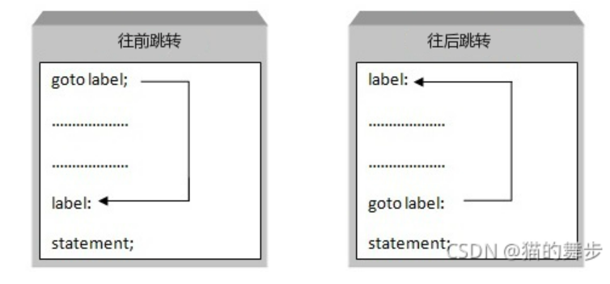

---
# 标题
title: goto的替代
# 时间
date: 2022/3/26  
# 分类
categories: 
- 课程笔记
# 标签
tags: 
- c
- c++
---

### 一、介绍
goto语句也称为无条件转移语句，当执行到goto语句后，程序将跳转到标签位置。例如下图：

### 二、使用
使用 goto语句在同一函数内进行 goto跳转时, goto的起点应是函数内一段小功能的结束处，goto跳转的目的 label处应是函数内另外一段小功能的开始处。

### 三、优缺点
1. 优点：使用goto语句，可以更改程序执行的正常顺序，因此可以跳转到程序的任何部分。
2. 缺点：
+ 使用goto语句，因为它会使程序逻辑非常复杂，不易阅读。
+ 使用goto使得分析和验证程序（尤其是涉及循环的程序）的正确性的任务非常困难。
+ 使用 goto语句只能将 goto跳转到同一函数内，而不能从一个函数里跳转到另外一个函数里。
+ goto不能从一段复杂的执行状态中的位置跳转到另外一个位置

### 四、替换
do while(1) 替换 goto
